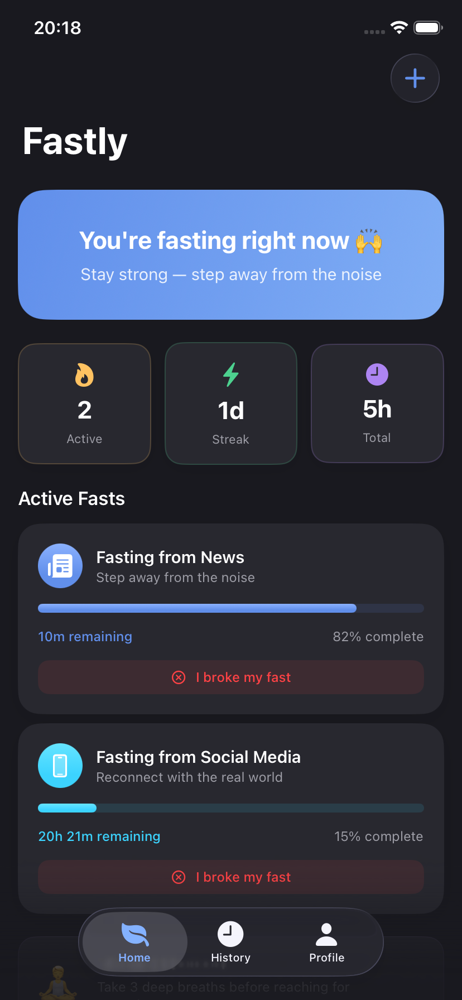

# Fastly

**Your fasting companion.**

In a world of endless notifications and infinite scroll, your attention is the most valuable thing you have. Fastly helps you take it back — one intentional fast at a time.

**How it works**
- **Pick your trigger** — News, social media, gossip, or create your own. No judgment, just clarity.
- **Set the duration** — From 1 hour to a full week. You’re in control.
- **Stay on track** — Live countdown, Home Screen widget, and gentle check-ins keep you accountable.
- **See your progress** — Streaks, history, and milestones so you can feel the difference.

Whether you’re stepping back from the 24-hour news cycle, cutting out social drama, or simply trying to be more present — Fastly gives you the structure to make it stick.

**Reclaim your attention. Feel the difference.**

[Get support & feedback](https://github.com/digital-fasting/fastly-app/issues/new)
